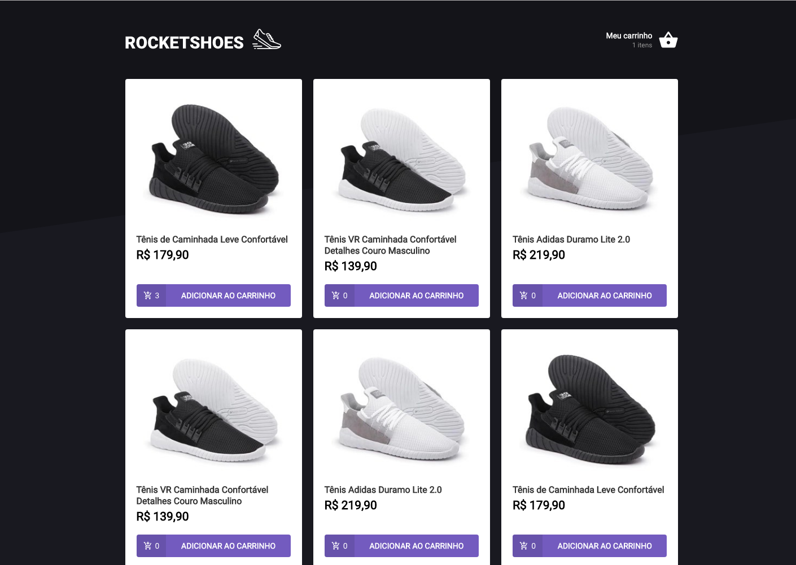
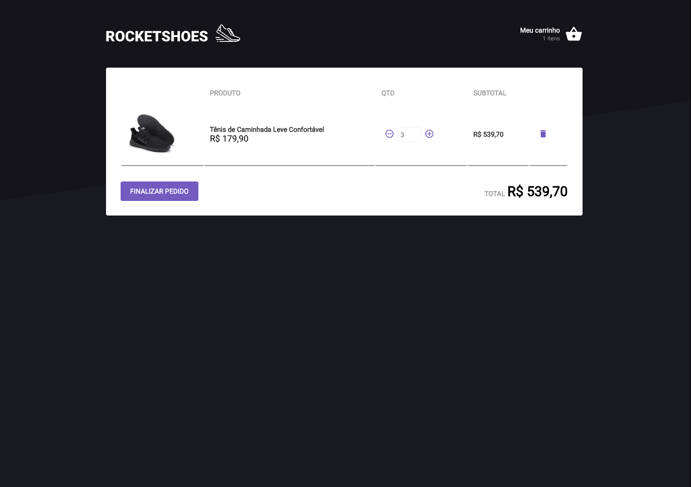
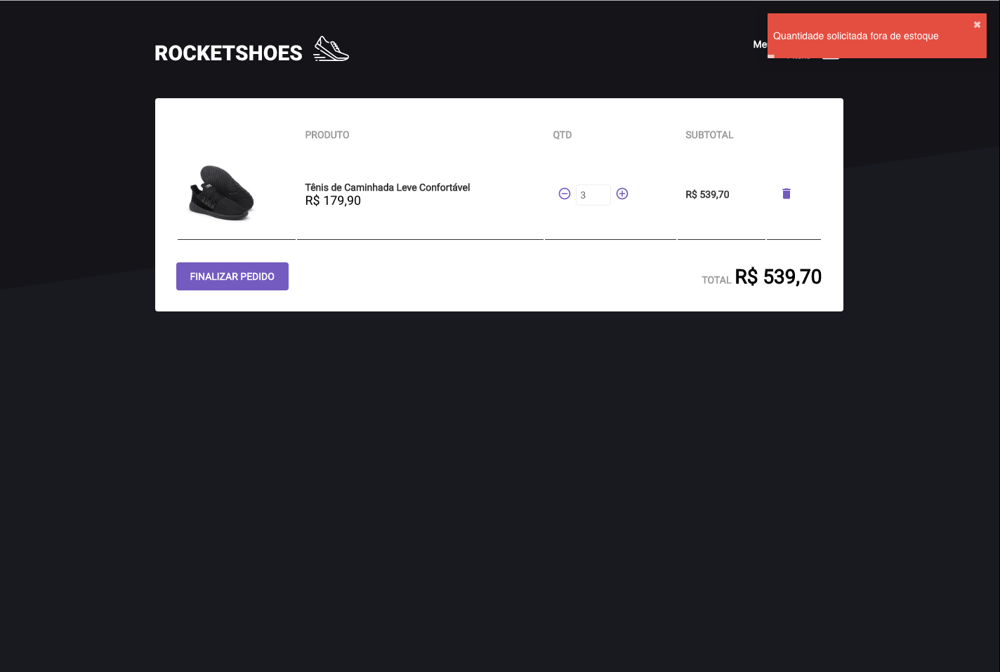

# e-commerce react

<ul>
  <li>Redux Concepts</li>
  <li>Project structure</li>
  <li>Configuring Routes</li>
  <li>Global style (styled-components)</li>
  <li>Seeking API products</li>
  <li>Configuring Redux</li>
  <li>Add/Remove product</li>
  <li>Redux Saga</li>
  <li>Querying stock</li>
</ul>

